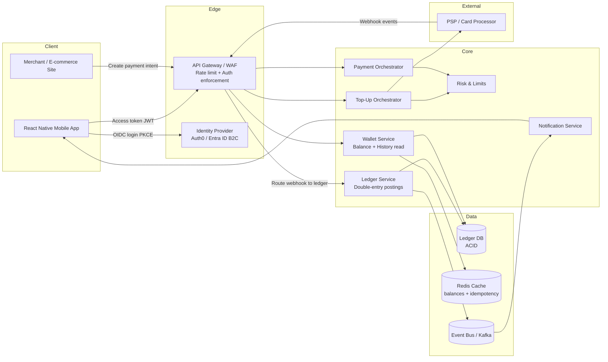

# Digital Wallet — System Architecture

```mermaid
flowchart LR
  subgraph Client
    M[React Native Mobile App]
    E[Merchant / E-commerce Site]
  end

  subgraph Edge
    GW[API Gateway / WAF<br>Rate limit + Auth enforcement]
    IDP[Identity Provider<br>Auth0 / Entra ID B2C]
  end

  subgraph Core
    WAL[Wallet Service<br>Balance + History read]
    TOP[Top-Up Orchestrator]
    PAY[Payment Orchestrator]
    LED[Ledger Service<br>Double-entry postings]
    RISK[Risk & Limits]
    NOTIF[Notification Service]
  end

  subgraph Data
    DB[(Ledger DB<br>ACID)]
    REDIS[(Redis Cache<br>balances + idempotency)]
    BUS[(Event Bus / Kafka)]
  end

  subgraph External
    PSP[PSP / Card Processor]
  end

  M -->|OIDC login PKCE| IDP
  M -->|Access token JWT| GW
  E -->|Create payment intent| GW

  GW --> WAL
  GW --> TOP
  GW --> PAY
  TOP --> RISK
  PAY --> RISK
  TOP --> PSP
  PSP -->|Webhook events| GW
  GW -->|Route webhook to ledger| LED

  LED --> DB
  WAL --> DB
  WAL --> REDIS
  LED --> BUS
  BUS --> NOTIF
  NOTIF --> M
```

